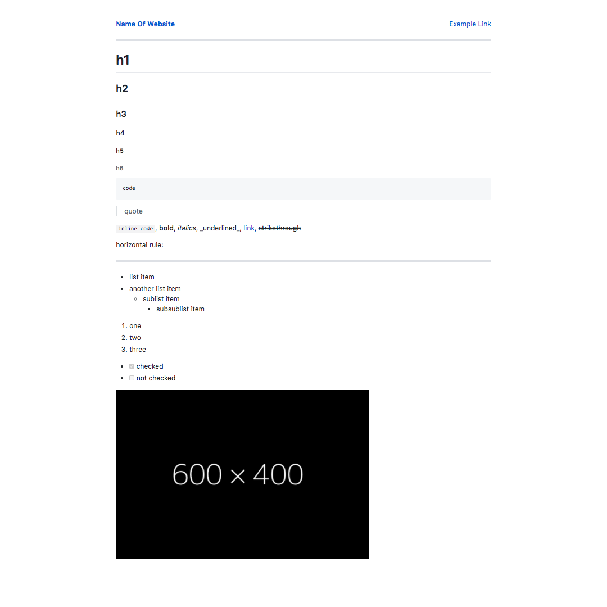

# static-markdown
Generate static sites using markdown or HTML ([Usage and CLI](docs/usage.md), [API](docs/api.md))

## Features

- Basic CLI
- API as a node module
- Markdown conversion
- Templating of constants and article metadata
- Multiple layouts/templates
- Nested directory handling
- Pre-made themes
- And more to come (See [TODO.md](TODO.md))

## Live Example

I used it to make my website, ([tripplyons.com](https://tripplyons.com/)).

## Themes

If you would like to add a theme, please create a pull request.

### GitHub Theme

Credit to [sindresorhus/github-markdown-css](https://github.com/sindresorhus/github-markdown-css) for the CSS.

