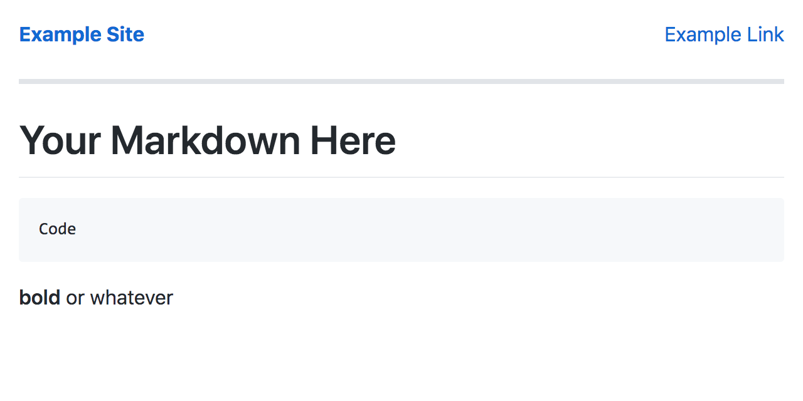

# static-markdown
Generate static sites using markdown or just HTML ([Usage and CLI](docs/usage.md), [API](docs/api.md))

## Features

- Basic CLI
- API as a node module
- Markdown conversion
- Templating constants and article metadata
- Nested directory handling
- And more to come (See [TODO.md](TODO.md))

## Live Example

I used it to make my website, ([tripplyons.com](https://tripplyons.com/)).

## A Screenshot

